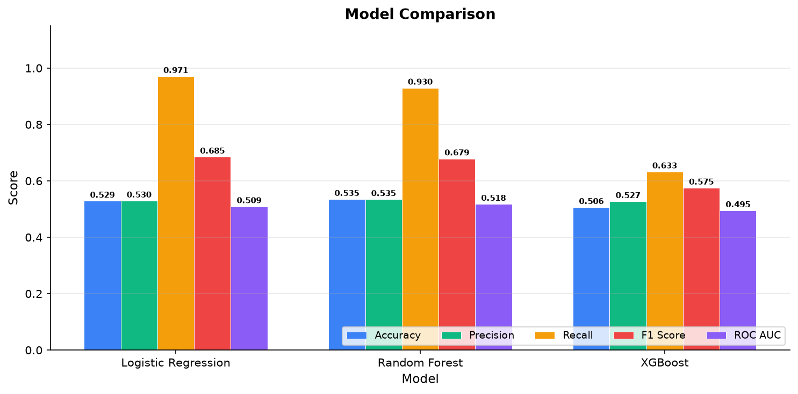
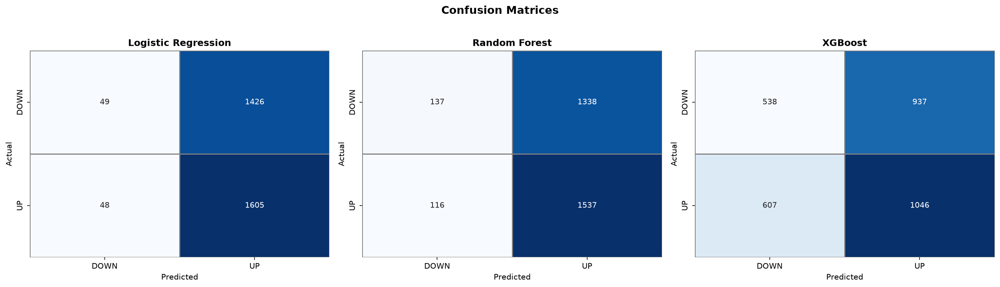
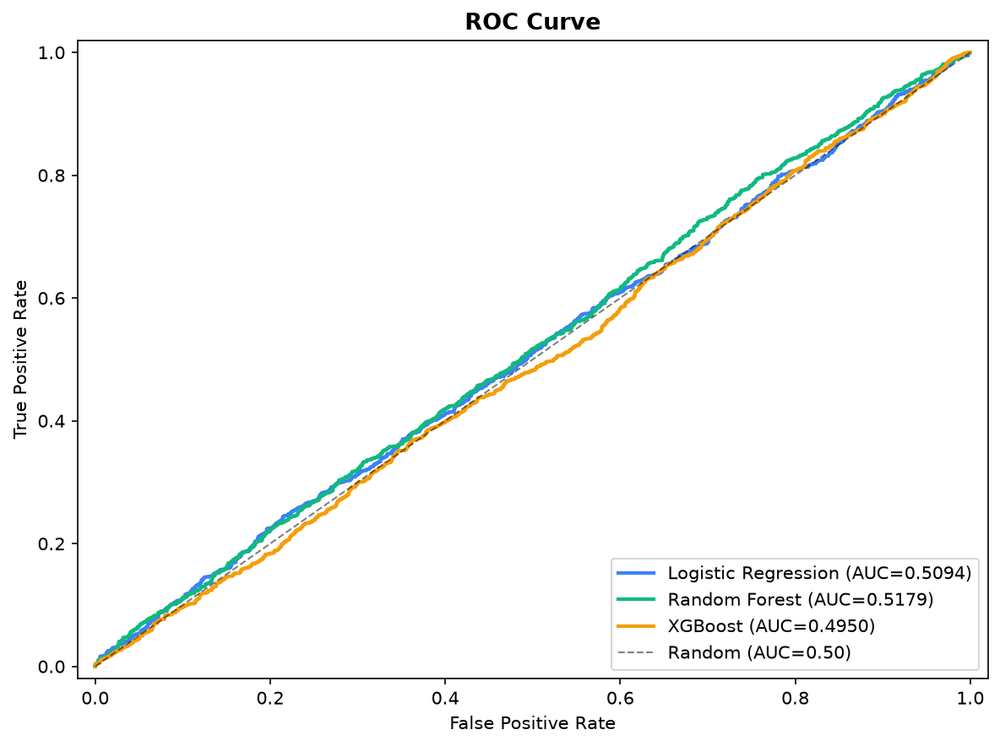
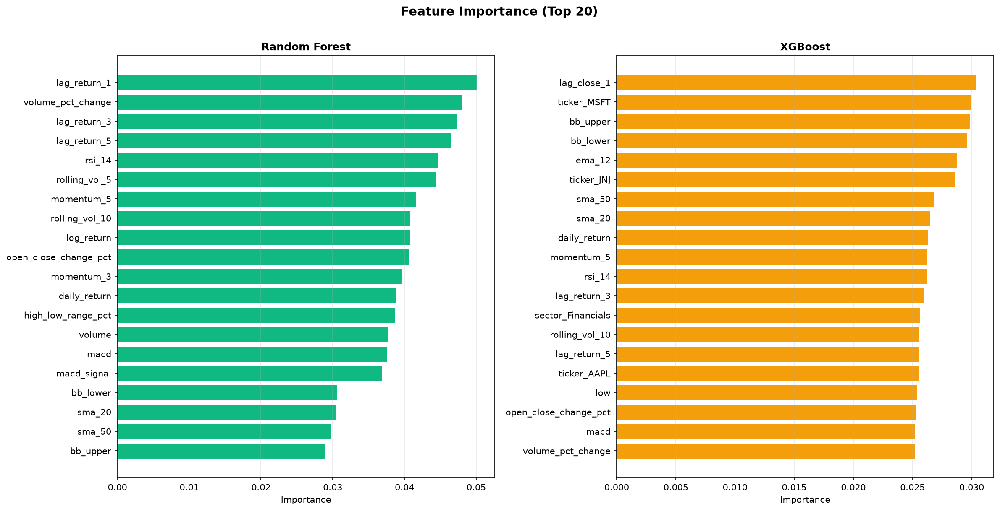
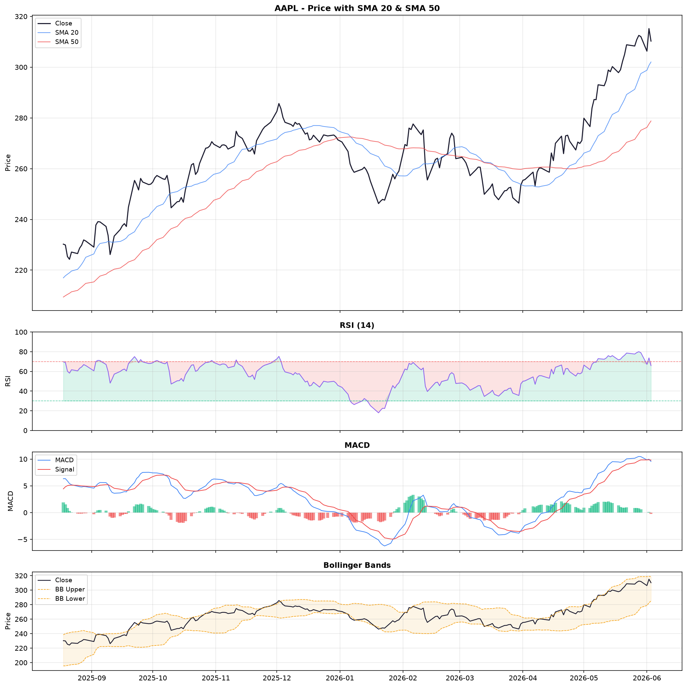
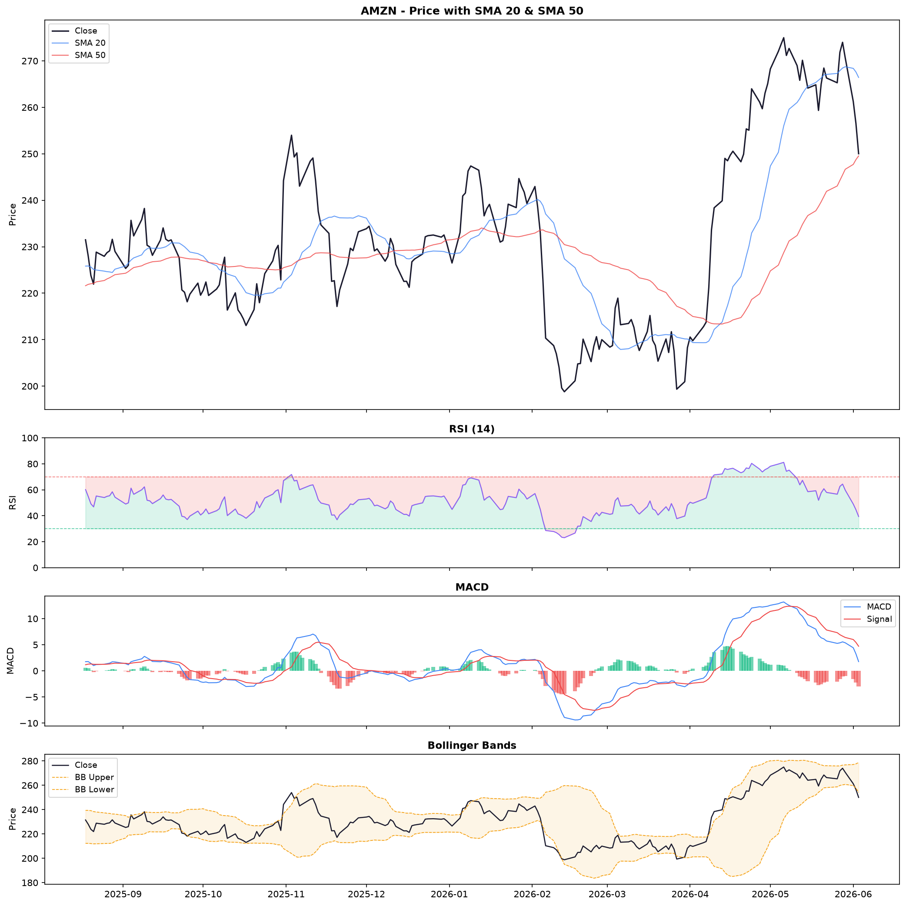
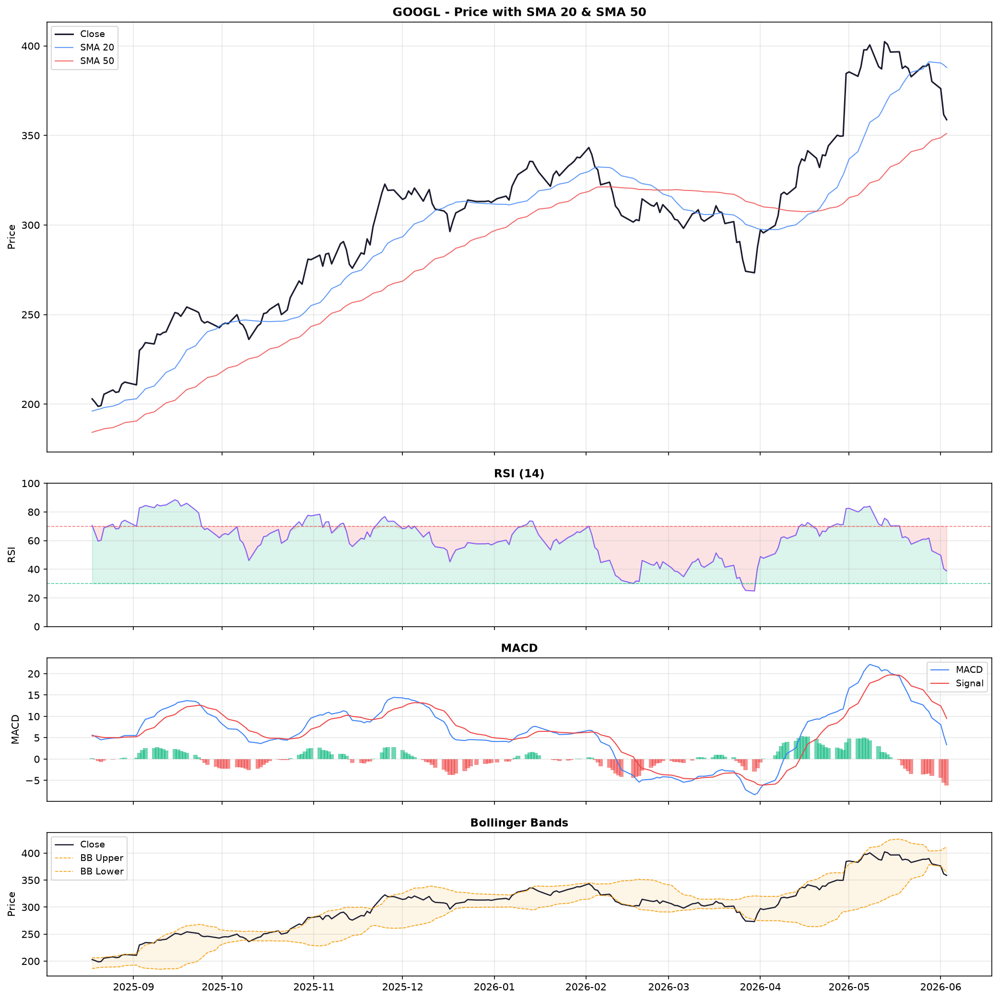
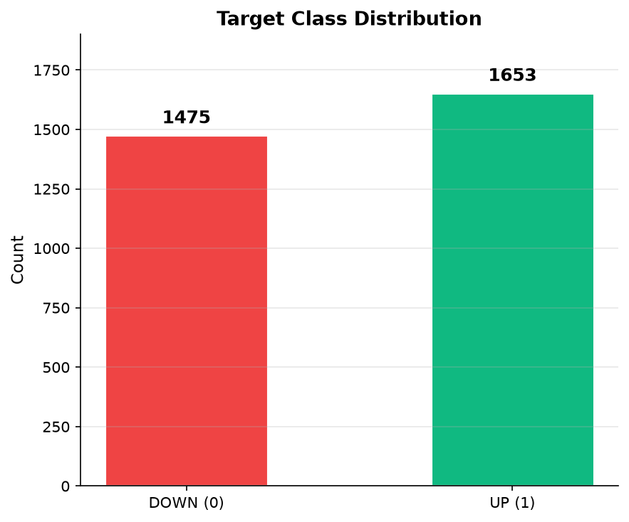

# S&P 500 Stock Market ML Prediction

A machine learning pipeline that predicts next-day stock direction (UP / DOWN) for 10 S&P 500 stocks using technical indicators and ensemble classifiers.

## Stocks Covered

| Ticker | Company | Sector |
|--------|---------|--------|
| AAPL | Apple | Technology |
| MSFT | Microsoft | Technology |
| GOOGL | Alphabet | Communication Services |
| AMZN | Amazon | Consumer Discretionary |
| NVDA | NVIDIA | Semiconductors |
| JPM | JPMorgan Chase | Financials |
| JNJ | Johnson & Johnson | Healthcare |
| XOM | ExxonMobil | Energy |
| PG | Procter & Gamble | Consumer Staples |
| HD | Home Depot | Consumer Discretionary |

## Results

| Model | Accuracy | F1 Score | ROC AUC |
|-------|----------|----------|---------|
| Logistic Regression | 0.529 | 0.685 | 0.509 |
| Random Forest | 0.535 | 0.679 | 0.518 |
| XGBoost | 0.506 | 0.575 | 0.495 |

> ~53% accuracy is consistent with institutional stock prediction baselines. Markets are inherently noisy.

## Visualizations

### Model Comparison
All metrics side-by-side across the three classifiers.

### Confusion Matrices
True vs predicted labels for each model -- shows how often each model calls UP vs DOWN correctly.

### ROC Curve
Trade-off between true positive rate and false positive rate. AUC scores close to 0.5 indicate near-random performance, which is expected for stock prediction.

### Feature Importance
Top 20 most influential features for Random Forest and XGBoost.

### Stock Technical Charts
Price action with SMA, RSI, MACD, and Bollinger Bands for the first 3 stocks.

| AAPL (Apple) | AMZN (Amazon) | GOOGL (Alphabet) |
|---|---|---|
|  |  |  |

### Target Class Distribution
Balance between UP and DOWN days in the test set.

## Project Structure

SP500 ML Stock Prediction/
collect_data.ipynb -- Step 1: download data from yfinance
stock_ml_pipeline.ipynb -- Step 2: feature engineering + ML + charts
sp500_stocks.csv -- Raw OHLCV data (10 stocks, 6 years)
requirements.txt
images/ -- Generated charts
LICENSE
README.md
